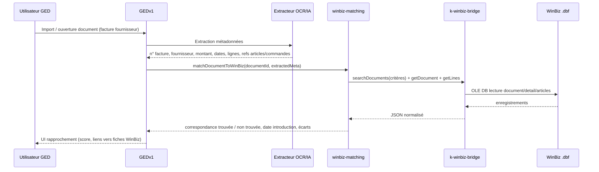
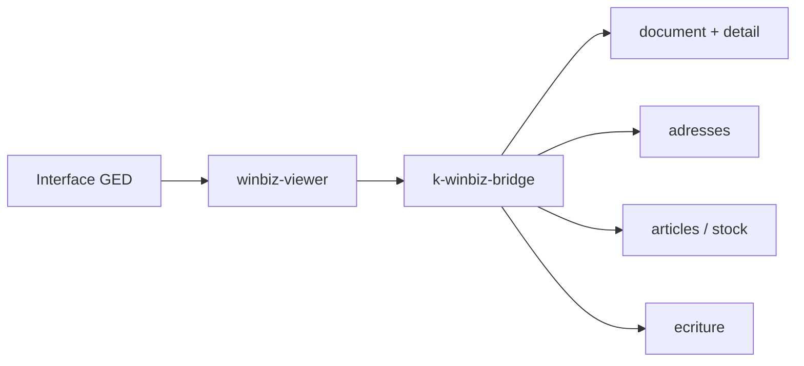

# WinBiz — module distinct (GEDv1 ↔ WinbizIntegrator)

> **Positionnement produit (2026-06-29)** : le plugin WinBiz est un **contrôle ERP optionnel**
> post-ingest, pas le moteur d'ingestion. OCR, split PDF et extraction lignes/TVA = **CMD v4 +
> GED core**. Voir **`docs/WINBIZ-PLUGIN-REPOSITIONNE.md`** (spec canonique lots A→D).
> Ce fichier reste la référence **terrain** (tables WinBiz, mapping bridge, API).

> État au 2026-06-17 — WinBiz n'est **pas** du code monolithique dans le core GEDv1.


## Principe


| Composant | Rôle | Emplacement |

|-----------|------|-------------|

| **GEDv1 (K-Docs)** | GED, workflows, app invoices, plugin WinBiz (orchestration UI + matching métier) | `F:\DATA\DEVELOPPEMENT\GEDv1` |

| **WinbizIntegrator** | Connecteur WinBiz complet (ODBC/OLEDB, lecture/écriture, schéma reverse) | `F:\DATA\DEVELOPPEMENT\WinbizIntegrator` |

| **Pont cible** | API REST JSON entre GED 64-bit et service WinBiz 32-bit | `WinbizIntegrator/k-winbiz-bridge/` |


**Ne pas dupliquer** le code de `k-winbiz-bridge` dans GEDv1. Le plugin GEDv1 = **orchestration UI + matching métier + appels bridge** ; l'accès données FoxPro reste dans WinbizIntegrator.


---


## Périmètre documents WinBiz (lecture)


Le plugin doit pouvoir lire dans WinBiz les types suivants :


| Type GED / métier | Tables WinBiz (bridge) | `DO_TYPE` (table `document`) | Compte (`DO_COMPTE`) | Notes |

|-------------------|------------------------|------------------------------|----------------------|-------|

| **Factures** (fournisseurs prioritaire) | `document` + `detail` + `adresses` | 20, 24, 30, 31, 43, 44 | `2000` (créancier) | Factures fournisseurs = mission P1 |

| **Factures clients** | idem | 10, 11, 12, 17 | `1100` (débiteur) | Consultation P2 |

| **Bulletins de livraison (BL)** | `document` + `detail` | 3 (BL), 21 (bulletin réception) | selon contexte | Liaison facture ↔ BL existante (MVP) |

| **Offres** | `document` + `detail` | 1 | — | Recherche croisée P1, consultation P2 |

| **Stock** | `articles` (+ `stock` si mouvements) | — | — | Codes article, quantités, prix ; `search_global` bridge |


Référence types : `WinbizIntegrator/k-winbiz-bridge/service/data_layer.py` (`DO_TYPE_MAP`, `COMPTE_DEBITEUR`, `COMPTE_CREANCIER`).


---


## Architecture plugin — deux capacités distinctes


Un **même plugin WinBiz** expose deux sous-modules logiques (pas deux dépôts) :


| Sous-module | Priorité | Rôle |

|-------------|----------|------|

| **`winbiz-matching`** | **P1** | Liaison document GED analysé ↔ références introduites dans WinBiz |

| **`winbiz-viewer`** | **P2** | Consultation lecture des documents WinBiz depuis la GED (sans obligation de matching) |


```

plugins/winbiz/                    # cible (ou apps/invoices/ + connectors/winbiz/ en transition)

├── WinBizPlugin.php               # boot, registre capacités

├── Matching/

│   ├── WinBizMatchingService.php  # winbiz-matching

│   └── MatchingController.php

├── Viewer/

│   ├── WinBizViewerService.php    # winbiz-viewer

│   └── ViewerController.php

└── Bridge/

    └── WinBizBridgeClient.php     # HTTP → k-winbiz-bridge :5100

```


---


## Mission 1 — Liaison document GED ↔ WinBiz (`winbiz-matching`, P1)


### Objectif


Faire la **liaison entre un document analysé dans la GED** (ex. facture fournisseur OCR/IA) et **retrouver si et quand des références ont été introduites dans WinBiz**.


C'est la **fonction prioritaire** du plugin.


### Flux détaillé





### Étapes fonctionnelles


1. **Document importé/analysé** dans GEDv1 (facture fournisseur, BL scanné, etc.)

2. **Extraction métadonnées** : n° document, fournisseur, montant TTC/HT, dates, lignes (code article, qté, prix), références commandes/offres/BL

3. **Recherche croisée WinBiz** sur factures, BL, offres, stock (selon type document GED)

4. **Résultat** :

   - correspondance **trouvée** / **non trouvée** / **partielle**

   - **date d'introduction** dans WinBiz (`DO_DATE1`, `DO_TIME`)

   - **écart** montant, quantités, lignes non rapprochées

   - lien vers fiche WinBiz (`DO_NUMERO`) pour consultation (`winbiz-viewer`)


### Critères de matching (proposés)


| Niveau | Critères | Poids indicatif | Source GED | Champ WinBiz |

|--------|----------|-----------------|------------|--------------|

| **Fort** | N° document exact | 40 | `invoice_number` | `DO_NODOC`, `DO_REF1` |

| **Fort** | Fournisseur (nom / n° compte) | 25 | `supplier_name`, `supplier_id` | `adresses.AD_SOCIETE`, `DO_ADR1` |

| **Moyen** | Montant TTC (± tolérance %) | 20 | `total_amount` | `DO_MONTANT` |

| **Moyen** | Date facture (± N jours) | 10 | `invoice_date` | `DO_DATE1` |

| **Ligne** | Code article | 50/ligne | `lines[].article_code` | `detail.DL_ARTICLE` / `articles.AR_CODE` |

| **Ligne** | Désignation fuzzy | 40 % similar_text | `lines[].description` | `detail.DL_DESIGN` |

| **Ligne** | Quantité / prix (± tolérance) | 10+15 | qty, unit_price | `DL_QTE`, `DL_PRIX` |

| **Référence** | N° BL / offre / commande | 30 | `references[]` | `DO_REF1`, `DO_REF2`, docs liés `DO_TYPE` 1/3 |


**Seuils** :


- `confidence >= 75` → correspondance **confirmée** (auto-lien possible)

- `40 <= confidence < 75` → **suggestion** (validation humaine)

- `< 40` → **non trouvé**


Réutiliser la logique existante `MatchingService::matchInvoiceToBL()` pour le rapprochement ligne BL ; étendre à factures fournisseurs et offres.


### Types de recherche croisée par document GED


| Type document GED | Recherche WinBiz prioritaire | Recherche secondaire |

|-------------------|------------------------------|----------------------|

| Facture fournisseur | Factures créancier (`DO_TYPE` 20, 30…) | BL (3, 21), offres (1), lignes stock |

| Facture client | Factures débiteur (10, 12, 17) | BL, offres |

| BL / bon réception | BL / bulletin réception | Factures liées, offres |

| Offre / devis | Offres (`DO_TYPE` 1) | Confirmations (2), BL, factures |

| Mouvement stock | `articles`, `stock` | Documents source (BL, factures) |


---


## Mission 2 — Consultation WinBiz depuis GED (`winbiz-viewer`, P2)


### Objectif


**Séparée** de la liaison — consultation utile en parallèle :


- Parcourir et **lire** factures, BL, offres, fiches stock **directement depuis la GED**

- Vue **lecture seule** (pas de matching obligatoire)

- Navigation document → lignes → client/fournisseur → écritures comptables (comme `explorer.py` `/document/<numero>`)


### Flux





### Écrans cibles (GED)


| Écran | Route cible | Données |

|-------|-------------|---------|

| Liste factures fournisseurs | `GET /winbiz/documents?type=facture_fournisseur` | Filtres date, fournisseur, montant |

| Liste BL | `GET /winbiz/documents?type=bl` | `DO_TYPE` 3, 21 |

| Liste offres | `GET /winbiz/documents?type=offre` | `DO_TYPE` 1 |

| Recherche stock | `GET /winbiz/stock?q=` | `articles` + quantités |

| Détail document | `GET /winbiz/documents/{do_numero}` | En-tête + lignes + partenaire + écritures |

| Recherche globale | `GET /winbiz/search?q=` | Délègue `search_global` bridge |


---


## Interfaces plugin proposées (à implémenter)


### Plugin principal


| Fonction | Signature (PHP) | Rôle |

|----------|-----------------|------|

| `WinBizPlugin::register()` | — | Enregistre `winbiz-matching` + `winbiz-viewer` dans `PluginRegistry` |

| `WinBizPlugin::boot()` | — | Charge config, vérifie health bridge |

| `WinBizPlugin::isEnabled()` | `bool` | `WINBIZ_ENABLED` + health OK |


### Bridge client (GED → WinbizIntegrator)


| Fonction | Signature | Mapping bridge |

|----------|-----------|----------------|

| `WinBizBridgeClient::health()` | `array` | `GET /api/v1/health` |

| `WinBizBridgeClient::getDocument(int $doNumero)` | `?array` | `GET /api/v1/tables/document/records/{id}` ou endpoint dédié |

| `WinBizBridgeClient::getDocumentLines(int $doNumero)` | `array` | `detail` filtré `DL_NUMERO` |

| `WinBizBridgeClient::searchDocuments(array $filters)` | `array` | Filtres `DO_TYPE`, `DO_COMPTE`, `DO_NODOC`, `DO_REF1`, dates, montant |

| `WinBizBridgeClient::searchArticles(string $query, int $limit)` | `array` | Table `articles` |

| `WinBizBridgeClient::getArticle(string $code)` | `?array` | `articles` par `AR_CODE` / `AR_NUMERO` |

| `WinBizBridgeClient::getStock(string $articleCode)` | `?array` | `articles` + `stock` si exposé |

| `WinBizBridgeClient::searchGlobal(string $query)` | `array` | Équivalent `data_layer.search_global` |

| `WinBizBridgeClient::getAddress(int $adNumero)` | `?array` | Table `adresses` |


> **Note** : certains endpoints dédiés existent côté Flask (`explorer.py` : `/document/<numero>`, `/search`) mais ne sont pas encore tous exposés en REST `/api/v1/`. Le bridge devra soit ajouter des routes API, soit le client GED compose via `tables/{table}/records` + filtres.


### winbiz-matching (P1)


| Fonction | Signature | Rôle |

|----------|-----------|------|

| `WinBizMatchingService::extractDocumentMeta(int $documentId)` | `array` | Agrège OCR + champs custom GED |

| `WinBizMatchingService::matchDocumentToWinBiz(int $documentId, ?array $meta = null)` | `WinBizMatchResult` | Point d'entrée principal mission 1 |

| `WinBizMatchingService::searchWinBizCandidates(array $meta, array $docTypes)` | `array` | Recherche multi-tables |

| `WinBizMatchingService::scoreCandidate(array $gedMeta, array $winbizDoc, array $lines)` | `float` | Score 0–100 |

| `WinBizMatchingService::matchInvoiceToSupplierInvoice(array $invoiceLines, array $wbLines)` | `array` | Extension facture fournisseur |

| `WinBizMatchingService::matchInvoiceToBL(array $invoiceLines, array $blLines)` | `array` | Existe : `MatchingService::matchInvoiceToBL()` — à déplacer/réutiliser |

| `WinBizMatchingService::matchToOffer(array $meta, array $offerDoc)` | `array` | Liaison offre ↔ document GED |

| `WinBizMatchingService::matchLineToStock(array $line, array $article)` | `?array` | Vérif code article / stock |

| `WinBizMatchingService::persistMatch(int $documentId, int $doNumero, float $confidence)` | `bool` | Colonnes matching BDD (`007_add_matching_columns.sql`) |

| `WinBizMatchingService::getMatchStatus(int $documentId)` | `?array` | État liaison + écarts |


### winbiz-viewer (P2)


| Fonction | Signature | Rôle |

|----------|-----------|------|

| `WinBizViewerService::listDocuments(string $type, array $filters, int $page)` | `array` | Listes factures / BL / offres |

| `WinBizViewerService::getDocumentDetail(int $doNumero)` | `array` | En-tête + lignes + partenaire |

| `WinBizViewerService::getDocumentAccounting(int $doNumero)` | `array` | Écritures `ecriture` |

| `WinBizViewerService::searchStock(string $query, int $limit)` | `array` | Consultation stock |

| `WinBizViewerService::search(string $query)` | `array` | Recherche globale |

| `WinBizViewerController::showDocument(Request, int $doNumero)` | `Response` | UI détail lecture |

| `WinBizViewerController::listByType(Request, string $type)` | `Response` | UI listes |


### Hooks plugin (événements GED)


| Hook | Action |

|------|--------|

| `document.classified` | Déclencher `matchDocumentToWinBiz` si type facture/BL |

| `document.validated` | Persister liaison confirmée |

| `invoice.validated` | Sync statut vers WinBiz (lecture seule : marquer rapproché côté GED) |


---


## État actuel dans GEDv1


### Stubs et connecteur léger


| Chemin | Contenu | Maturité |

|--------|---------|----------|

| `connectors/winbiz/WinBizConnector.php` | Connexion ODBC directe (~240 lignes) | Lecture — fallback dev 32-bit |

| `connectors/winbiz/config.php` | DSN, tables FoxPro, field_mapping | Config locale — à aligner sur `reverse/schema.json` |

| `apps/invoices/` | Routes, `MatchingController`, UI rapprochement | Stubs / MVP facture ↔ BL |

| `app/Services/MatchingService.php` | `matchInvoiceToBL()` | MVP P1 partiel |

| `app/Core/PluginRegistry.php` | Enregistrement plugins | Fonctionnel |


### Ce qui manque (par priorité)


**P1 — winbiz-matching**


1. `WinBizBridgeClient` — client HTTP vers `k-winbiz-bridge` (pas ODBC direct en prod)

2. `WinBizMatchingService::matchDocumentToWinBiz()` — orchestration complète

3. Recherche factures **fournisseurs** (`DO_COMPTE=2000`, `DO_TYPE` 20/30…)

4. Recherche croisée offres + stock

5. Persistance résultats matching + UI écarts


**P2 — winbiz-viewer**


6. Routes consultation `/winbiz/documents`, `/winbiz/stock`, `/winbiz/search`

7. Templates lecture document (sans flux matching)


**Transverse**


8. App invoices inactive — `INVOICES_APP_ENABLED=false` par défaut

9. Écriture FoxPro — interdite dans le core ; déléguée à `k-winbiz-bridge/service/write_layer.py`


---


## WinbizIntegrator — structure et mapping


```

WinbizIntegrator/

├── k-winbiz-bridge/

│   ├── service/

│   │   ├── oledb_bridge.py    # Couche OLE DB VFP (32-bit)

│   │   ├── data_layer.py      # DO_TYPE_MAP, search_global, lecture tables

│   │   ├── write_layer.py     # Écriture sécurisée (backup, locks)

│   │   ├── reconciliation.py  # Rapprochement compta (référence, pas API GED)

│   │   ├── explorer.py        # UI Flask : /document, /search, /invoices

│   │   └── invoice_*.py       # Préparation / génération factures

│   ├── reverse/schema.json    # Schéma reverse — source vérité field_mapping

│   ├── docs/                  # SCHEMA.md, TABLES.md, RELATIONS.md

│   └── config/config.json     # data_path, read_only, port (défaut 5100)

```


### Mapping GED plugin → bridge


| Besoin plugin GED | Module bridge | Méthode / route actuelle | REST cible |

|-------------------|---------------|--------------------------|------------|

| Health | service | `GET /api/v1/health` | ✅ documenté |

| Document + lignes | `data_layer` + `explorer.py` | `/document/<numero>` (Flask) | `GET /api/v1/documents/{numero}` *(à ajouter)* |

| Recherche globale | `data_layer.search_global` | `/search?q=` (Flask) | `GET /api/v1/search?q=` *(à ajouter)* |

| Liste factures fourn. | `data_layer` filtres `document` | `/invoices` (Flask) | `GET /api/v1/documents?compte=2000&type=20` *(à ajouter)* |

| Articles / stock | tables `articles`, `stock` | `GET /api/v1/tables/articles/records` | ✅ générique |

| Adresses fournisseur | table `adresses` | via FK `DO_ADR1` | `GET /api/v1/tables/adresses/records/{id}` |

| Écritures comptables | table `ecriture` | inclus dans `/document/<numero>` | jointure API document |


### API REST bridge (existant + extensions prévues)


```

GET  /api/v1/health

GET  /api/v1/tables/{table}/records

GET  /api/v1/tables/{table}/records/{id}

POST /api/v1/tables/{table}/records          # si read_only=false


# Extensions recommandées pour le plugin GED (à implémenter côté bridge)

GET  /api/v1/documents/{do_numero}           # en-tête + detail + adresses + ecritures

GET  /api/v1/documents?type=&compte=&from=&to=&q=

GET  /api/v1/search?q=

GET  /api/v1/articles/{code}

GET  /api/v1/articles?q=

```


Voir `WinbizIntegrator/k-winbiz-bridge/README.md` et `REGLES_IMMUABLES.md`.


---


## Vision d'intégration globale


```

┌─────────────────────────────────────────────────────────────────┐

│  GEDv1                                                          │

│  ┌──────────────────┐    ┌──────────────────┐                   │

│  │ winbiz-matching  │    │ winbiz-viewer    │                   │

│  │ (P1 liaison)     │    │ (P2 consultation)│                 │

│  └────────┬─────────┘    └────────┬─────────┘                   │

│           └──────────┬────────────┘                             │

│                      │ WinBizBridgeClient (ConnectorInterface)  │

└──────────────────────┼──────────────────────────────────────────┘

                       │ HTTP JSON :5100

┌──────────────────────▼──────────────────────────────────────────┐

│  WinbizIntegrator / k-winbiz-bridge (32-bit)                    │

│  data_layer · explorer · write_layer → WinBiz .dbf .cdx         │

└─────────────────────────────────────────────────────────────────┘

```


### Étapes recommandées


1. **Créer `WinBizBridgeClient`** — implémente `ConnectorInterface`, appelle le bridge REST.

2. **Implémenter `winbiz-matching`** — `matchDocumentToWinBiz()` + persistance.

3. **Conserver `WinBizConnector` ODBC** comme fallback dev / diagnostic uniquement.

4. **Réutiliser `reverse/schema.json`** pour valider `connectors/winbiz/config.php`.

5. **Activer `apps/invoices/`** quand le bridge répond sur `GET /health`.

6. **Implémenter `winbiz-viewer`** — routes consultation séparées du matching.

7. **Étendre API bridge** — endpoints `/documents` et `/search` si besoin perf.


---


## Références croisées


| Document | Contenu |

|----------|---------|

| `docs/PLUGIN-SYSTEM.md` | Architecture plugins, deux capacités WinBiz |

| `docs/DELTA-REDX.md` | Gaps P1 WinBiz (factures, BL, offres, stock, consultation) |

| `SESSION-STATUS.md` | Prochaine fonction : plugin WinBiz P1 + P2 |

| `WinbizIntegrator/k-winbiz-bridge/README.md` | Installation et API bridge |

| `WinbizIntegrator/k-winbiz-bridge/service/data_layer.py` | `DO_TYPE_MAP`, classification documents |


---

*Dernière mise à jour : 2026-06-17 — spec liaison + consultation*

