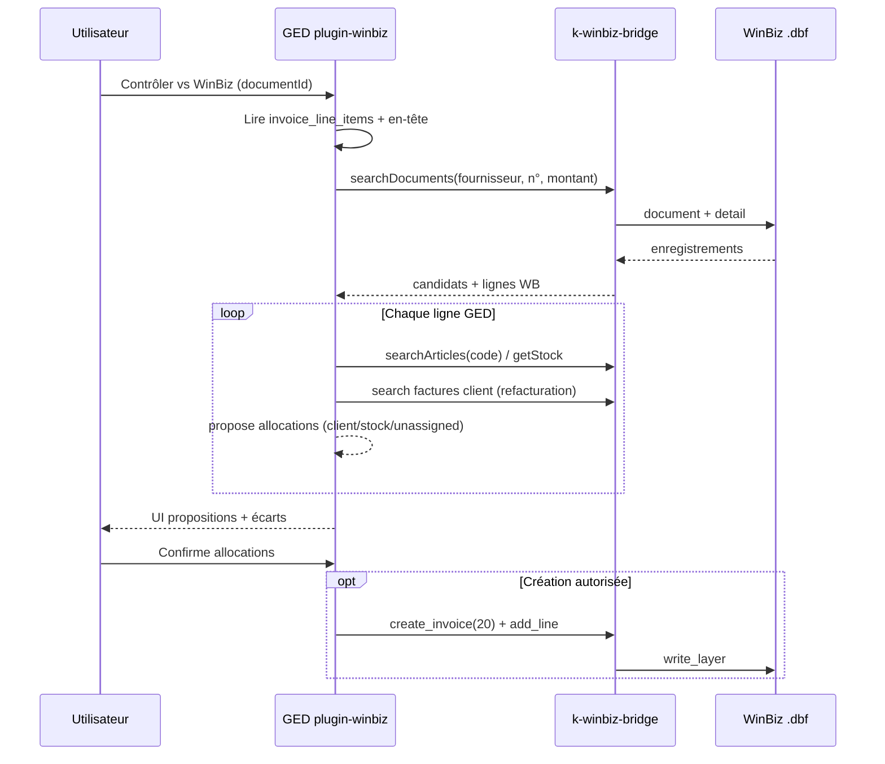

# Plugin WinBiz — repositionnement (contrôle ERP optionnel)

> **Statut** : spec produit approuvée en revue — 2026-06-29 · **complétée par l'addendum
> 2026-07-03 ci-dessous (décision : K-Time = canal d'introduction/validation)**  
> **Dépôt** : `F:\DATA\DEVELOPPEMENT\GEDv1`  
> **Remplace pour le positionnement** : sections « Mission 1 matching P1 » et flux OCR/split de `docs/WINBIZ-MODULE.md` (2026-06-17).  
> **Conserve** : architecture bridge, mapping tables WinBiz, références `WinbizIntegrator/k-winbiz-bridge/`.

---

## Addendum 2026-07-03 — décision produit : flux via K-Time (« liaison ERP »)

> Décision Olivier 2026-07-03. Principe : **on ne réinvente rien** — CMD v4 sait scanner,
> séparer et extraire les champs facture ; **K-Time** (`F:\DATA\DEVELOPPEMENT\K-TIME`,
> `k-time-web` PHP/MariaDB, bien avancé : factures, paiements créanciers, stock, vente au
> comptant FT→facture, affaires `PJT_PROJ`, sync bridge, anti-doublon) possède déjà la
> mécanique métier et le reverse WinBiz via WinbizIntegrator.

### Flux décidé

```
1. Ingestion GED → CMD v4 : identification facture + extraction champs
   (fournisseur, n°, dates, lignes, produits, montants, qtés)
2. Plugin « liaison ERP » (agnostique — WinBiz aujourd'hui, autre demain ;
   K-Time n'est pas sectaire) :
   a. identifier l'expéditeur (fournisseur) via les APIs K-Time
   b. identifier la VENTILATION habituelle des articles de ce fournisseur :
      stock · vente au comptant · facture · fiche de travail · pas encore introduit
   c. récupérer si la facture EXISTE DÉJÀ (dédup — K-Time/bridge font foi)
3. Présentation claire de ce qui est identifié + préparation de l'introduction
4. INTRODUCTION : document GED → K-Time (flag « saisie depuis ged »)
   → validation utilisateur dans K-Time : OK → sync WinBiz
5. VALIDATION « bon pour accord » : même chemin → K-Time → document validé
   en GED → la facture est flaguée « bon pour accord »
```

### Conséquences sur la spec 2026-06-29

| Point | Avant (spec 2026-06-29) | Décidé 2026-07-03 |
|-------|--------------------------|-------------------|
| Backend couche 2 | GED → `k-winbiz-bridge` direct | **GED → API K-Time** (k-time-web) ; K-Time parle au bridge. La GED n'écrit JAMAIS dans WinBiz. |
| Question ouverte #2 (création facture) | A/B/C | **Toujours via K-Time + validation utilisateur** — jamais d'écriture auto depuis la GED |
| Question ouverte #4 (`client_rebill` → `invoice_prep`) | A/B/C | **Généralisé** : toute introduction passe par K-Time |
| Question ouverte #5 (bac à sable écriture) | Recommandé | **La validation K-Time EST la barrière** (flag « saisie depuis ged » + OK humain avant sync) |
| Types d'allocation | client_rebill / stock / supplier_match / unassigned / internal | **stock · vente_comptant · facture · fiche_travail · non_introduit** (aligné sur la ventilation K-Time ; mapper l'enum `invoice_line_allocations`) |
| `winbiz-viewer` (P2, GAP-018/019) | P2 inchangé | **Non-objectif** — rapatrier les pièces WinBiz dans la GED n'apporte rien au flux facture (« pipo ») ; abandonné sauf besoin futur |
| Traçabilité | — | Flags croisés : `saisie depuis ged` (côté K-Time) · `bon pour accord` (retour GED + facture) |

### Clarifications tranchées le 2026-07-03 (après inventaire croisé)

> **Spec d'échange canonique : `K-TIME/docs/SPEC-GED-INTEGRATION.md`**
> (contrat producteur/consommateur, endpoints, migration 082 K-Time, lots GED-1→4).

1. **Surface API k-time-web** : rien n'existait pour un service externe sur les
   factures reçues → à créer côté K-Time (lots GED-1→4 de la spec) :
   `POST /api/ged/received-invoices` (brouillon `source='ged'` + `external_ref` =
   id document GED, idempotent), `GET …/exists` (dédup), `GET …/{id}` (statut
   validation), `GET /api/ged/suppliers/lookup` + `…/{id}/ventilation`.
2. **Pas de flag WinBiz** (décision Olivier) : WinBiz travaille avec des
   **catégories définies par l'utilisateur** → liaison via `DOC_CAT`
   (`DO_CATEGO` → `CA_NUMERO`, `CA_CODE` C60 p.ex. `GED-…`) + discriminants
   natifs `DO_TYPE`/`DO_COMPTE`. Le flag vit dans **K-Time**
   (`source='ged'`, `validation_status`, `validated_by/at`) et le **même dans
   la GED** (lien d'évidence : `external_ref` ↔ document, « bon pour accord »
   + qui + quand, récupéré en **pull** — pas de webhook tant que les produits
   vivent séparément).
3. **Auth** : **token de service** dédié (`ged_api_key`, header `X-Api-Key`) —
   pas d'uniformisation des identités pour l'instant ; produits séparés puis
   écosystème.
4. **CMD v4** : la GED n'est jamais morte sans CMD v4 (fallback natif existant),
   mais n'implémente **pas** ses fonctions avancées en doublon — l'extraction
   facture vit dans CMD v4, K-Time reçoit du structuré.

---

## Cadre connecteurs

Architecture globale : **`docs/CONNECTEURS-PLUGINS.md`** — GED autonome, CMD v4 en renfort ingest (pas obligatoire), plugins ERP/métier activés par chemins et health.

## Décision

Le plugin WinBiz **n'est pas** la condition d'ingestion documentaire. Ce n'est **pas** un second ERP.

| Rôle | Responsable | Obligatoire ? |
|------|-------------|---------------|
| **Comprendre le document** (OCR, split, lignes, TVA, fournisseur) | GED core + **CMD v4** | Oui — fonctionne sans WinBiz |
| **Contrôler / ventiler vs ERP** (WinBiz, puis Bexio) | Plugin ERP optionnel | Non — action volontaire ou workflow explicite |

La GED ingère proprement et produit un document **structuré et ERP-agnostique**. Ensuite, si WinBiz est activé, l'utilisateur peut lancer **« Contrôler vs WinBiz »** pour affecter les positions de facture, vérifier l'existence d'articles, proposer refacturation client ou stock.

L'ingest doit **anticiper** ce second temps (tables lignes + allocations) sans y dépendre.

---

## Vision métier (exemple)

1. Scan d'un PDF → OCR → **split** si 2 fournisseurs sur N pages (CMD v4 `segment`).
2. Extraction structurée : fournisseur, n° facture, dates, **lignes articles**, totaux HT/TVA/TTC.
3. Document GED validé en workflow classique (sans WinBiz).
4. Utilisateur ouvre **« Contrôler vs WinBiz »** sur une facture fournisseur.
5. Pour la ligne « article ABC × 15 » :
   - **5** → refacturation client A (lien facture client `DO_NODOC` existante),
   - **5** → stock (`AR_CODE`),
   - **5** → non attribué (suspens GED).
6. Propositions scorées ; validation humaine ; création ou liaison WinBiz via bridge si confirmé.

---

## Architecture en deux couches

```
┌─────────────────────────────────────────────────────────────────┐
│  COUCHE 1 — GED CORE (toujours active, ERP-agnostique)          │
│                                                                 │
│  Upload / consume / email (.msg)                                │
│       → CMD v4 extract (PDF, OCR, Office, PJ récursives)      │
│       → CMD v4 segment (multi-pièces / multi-fournisseurs)      │
│       → CMD v4 classify + fields (schémas configurables)        │
│       → Persistance : documents, invoice_line_items, totals     │
│       → UnifiedClassifier + taxonomie HTMLEDITOR                │
│       → Workflows, SMQ, archivage                               │
└────────────────────────────┬────────────────────────────────────┘
                             │ document compris + lignes
                             ▼
┌─────────────────────────────────────────────────────────────────┐
│  COUCHE 2 — PLUGINS ERP (optionnels)                            │
│                                                                 │
│  plugin-winbiz          plugin-bexio (futur)                    │
│  · analyzeInvoice       · même contrat ErpInvoiceControl        │
│  · proposeLineAllocations                                       │
│  · applyAllocations (écriture gated)                            │
│       │                                                         │
│       └── ConnectorInterface HTTP ──────────────────────────────┤
└────────────────────────────┼────────────────────────────────────┘
                             ▼
              k-winbiz-bridge :5100 (WinbizIntegrator)
              · data_layer · write_layer · invoice_gen
              · client_matcher · invoice_prep · time_tracker (K-Time)
```

### Composants externes — ne pas dupliquer

| Composant | Emplacement | Usage plugin GED |
|-----------|-------------|------------------|
| Accès FoxPro / OLE DB | `WinbizIntegrator/k-winbiz-bridge/` | **Seule** porte données WinBiz |
| Création factures | `service/invoice_gen.py` | Facture fourn. `doc_type=20`, lignes `add_line` |
| Matching clients | `service/client_matcher.py` | Fournisseur / client |
| Résolution article | `invoice_prep.resolve_product()` + `config/product_match.json` | Ligne → `AR_NUMERO` |
| K-Time opérationnel | `service/time_tracker.py` + UI Flask | **Pas** `apps/timetrack/` GED (stub) |
| ODBC direct PHP | `connectors/winbiz/WinBizConnector.php` | Fallback dev / diagnostic uniquement |

---

## Couche 1 — Ingestion et compréhension (Lot A)

### Objectif

Atteindre le niveau REDX sur **capture et structuration** sans brancher WinBiz.

### Pipeline cible

```
Entrée fichier
    → CMD v4 preingest (extract.py : PDF, image OCR, Office, MSG + PJ)
    → CMD v4 segment (multi-documents dans un même PDF)
    → CMD v4 fields + gate (schémas legal_ch + extension facture)
    → Mapper résultat → tables GED MySQL
    → Queue classification (UnifiedClassifier) si besoin complément
    → Document « compris » (gate documentaire)
```

### Intégration CMD v4 vs v3

| Aspect | v3 (actuel GED) | v4 (cible factures) |
|--------|-----------------|---------------------|
| Sidecar | `clearmydocs-v3/.../ged_sidecar.py` port 5101 | `cmdv4/product/server.py` (FastAPI, port **8510**) |
| Segment | `/segment` | `cmd4/segment.py` |
| Schémas pièces | Profils builtin v3 | `cmdv4/product/builtin_schemas/legal_ch.json` |
| Gate fidélité | partiel | `cmd4/gate.py` + `product/fields.py` |
| Lignes facture | absent schéma v4 | **à étendre** (voir § Schémas) |

Routage GED : `IngestEngineRouter` (CMD v4 si facture + joignable, sinon natif) — voir `docs/CMD-V4-CONNECTOR.md`.
**API v4** : `clearmydocs-v3/cmdv4/docs/API.md` · adaptateur GED : `docs/CMD-V4-CONNECTOR.md`.  
Évolution : sonde **CMD v4** pour le lot factures ; conserver fallback natif GED.

### Schéma CMD v4 — extension `facture_fournisseur`

État actuel (`cmdv4/product/builtin_schemas/legal_ch.json`) : en-tête seulement.  
Extension **donnée de config** (zéro code moteur) :

```json
{
  "facture_fournisseur": {
    "fields": {
      "type_piece":   { "type": "string", "values": ["facture"] },
      "fournisseur":  { "type": "string" },
      "date":         { "type": "date" },
      "numero":       { "type": "string" },
      "montant_ht":   { "type": "amount" },
      "montant_tva":  { "type": "amount" },
      "montant_ttc":  { "type": "amount" },
      "taux_tva":     { "type": "amount" }
    },
    "lines": {
      "article_code": { "type": "string" },
      "description":  { "type": "string" },
      "quantity":     { "type": "amount" },
      "unit_price":   { "type": "amount" },
      "tax_rate":     { "type": "amount" },
      "line_total":   { "type": "amount" }
    },
    "key": ["fournisseur", "numero"]
  }
}
```

### Persistance GED (existant à brancher)

| Table / API | Rôle |
|-------------|------|
| `invoice_line_items` | Lignes extraites (migration 023) |
| `invoice_extraction_results` | JSON brut CMD / IA |
| `POST /api/documents/{id}/line-items/extract` | Extracteur actuel — **alimenter depuis CMD v4**, pas parallèle |
| Champs `projet`, `centre_cout`, `compte_comptable` sur lignes | Réservés ventilation métier (couche 2) |

### Gate « document compris »

Un document est prêt pour contrôle ERP si :

- `type_piece` = facture fournisseur (classification ou schéma CMD),
- en-tête : fournisseur + n° + date + TTC présents,
- ≥ 1 ligne dans `invoice_line_items`,
- cohérence somme lignes ≈ totaux (tolérance configurable).

Sans cette gate : pas d'onglet WinBiz (message « extraction incomplète »).

### Fichiers clés Lot A

| Fichier | Action |
|---------|--------|
| `app/Services/Ingest/IngestEngineRouter.php` | Route factures → CMD v4 |
| `app/Services/Ingest/CmdV4Client.php` | HTTP API CMD v4 |
| `app/Models/InvoiceLineItem.php` | Upsert depuis mapper CMD |
| `docs/CMD-V4-CONNECTOR.md` | Adaptateur GED CMD v4 |

---

## Couche 2 — Plugin WinBiz (Lot B)

### Objectif

**Contrôler** une facture fournisseur déjà structurée : existence WinBiz, ventilation lignes, création optionnelle.

Renommage conceptuel recommandé :

| Ancien (WINBIZ-MODULE.md) | Nouveau |
|---------------------------|---------|
| `winbiz-matching` P1 | **`winbiz-control`** |
| `matchDocumentToWinBiz()` dès classify | **`analyzeInvoice()`** sur action utilisateur |
| Recherche croisée en-tête seule | **Ventilation par ligne** + contrôle en-tête |

`winbiz-viewer` (consultation lecture seule) reste **P2**, inchangé.

### Déclenchement

| Mode | Détail |
|------|--------|
| **Manuel** | Bouton / onglet modale document : « Contrôler vs WinBiz » |
| **Workflow** | Nœud explicite `erp_control_winbiz` (jamais implicite à l'upload) |
| **Désactivé** | `WINBIZ_ENABLED=false` ou bridge down → zéro UI, ingest normal |

**Interdit** : hook `document.classified` → matching auto (ancienne spec). Remplacé par hook optionnel `document.validated` → **suggestion** uniquement, pas d'écriture auto.

### Flux contrôle



### Types d'allocation (ventilation)

| `allocation_type` | Métier | Référence WinBiz typique |
|-------------------|--------|--------------------------|
| `client_rebill` | Refacturation client | Facture client `DO_TYPE` 10/12, `DO_NODOC` |
| `stock` | Entrée / réservation stock | `articles.AR_CODE`, `ar_stock` |
| `supplier_match` | Ligne déjà dans facture fourn. WB | `detail.DL_NUMERO`, `DL_ARTICLE` |
| `unassigned` | Suspens — décision ultérieure | — |
| `internal` | Charge interne / compte | `compte_comptable` (GED) |

Une ligne GED peut être **fractionnée** : qty 15 → 5+5+5 sur plusieurs allocations.

### Scoring (réutiliser l'existant)

| Source GED | Logique existante | Extension |
|------------|-------------------|-----------|
| Ligne ↔ BL | `MatchingService::matchInvoiceToBL()` | Réutiliser tel quel |
| Fournisseur | — | `client_matcher.match_client()` (bridge) |
| Article | — | `resolve_product()` + `searchArticles` |
| En-tête facture fourn. | Spec ancienne WINBIZ-MODULE | `searchDocuments` filtres `DO_TYPE` 20/30, `DO_COMPTE=2000` |

Seuils proposés (inchangés) : ≥75 confirmé · 40–74 suggestion · <40 non trouvé.

### Écriture WinBiz

- **Lecture** : toujours via bridge REST.
- **Écriture** : `write_layer.py` uniquement ; `service.read_only=false` + validation humaine.
- **Création facture fournisseur** : `InvoiceGenerator.create_invoice(client_id, doc_type=20)` + `add_line()`.
- **Stock** : phase 1 = **vérification existence article** ; phase 2 = mouvement stock (décision produit § Ouvert).

### Structure code cible (GED)

```
app/Services/Erp/
├── ErpInvoiceControlInterface.php
├── ErpControlResult.php
└── WinBiz/
    ├── WinBizErpControlService.php    # implémente interface
    ├── WinBizBridgeClient.php         # HTTP complet (étendre stub)
    └── WinBizAllocationProposer.php   # ventilation lignes

apps/invoices/                         # UI plugin (pas app parallèle)
├── routes.php                         # gated INVOICES_APP_ENABLED
└── templates/control_panel.php        # onglet modale document

PluginRegistry : enregistrer « winbiz » comme connecteur ERP, pas comme moteur ingest.
```

### UI

- **Emplacement** : onglet **« Contrôle WinBiz »** dans la modale document (`templates/documents/index.php`), gated `WINBIZ_ENABLED` + bridge health.
- **Pas** de 6e entrée sidebar — action contextuelle sur fiche facture.
- **Pas** de page `/invoices` parallèle à la bibliothèque (principe REDX : même fiche document).
- Affichage : en-tête (trouvé / écart montant / date introduction) + grille lignes avec colonnes allocation proposée / confirmée.

---

## Consolidation K-Time (Lot C)

K-Time **opérationnel** = `k-winbiz-bridge` (`time_tracker.py`, `invoice_prep`, UI `/timetracker`).

| Flux | Direction | Lien GED |
|------|-----------|----------|
| Temps → facture client | K-Time → WinBiz | Hors plugin factures fournisseurs |
| Facture fourn. ventilée « client_rebill » | GED → bridge | Référencer `AD_NUMERO` / projet `pjt_proj` |
| Clients partagés | `adresses` WinBiz | `correspondents` GED ↔ `tt_clients.ad_numero` |

**Règle** : ne pas réimplémenter sync clients/projets dans `apps/timetrack/` GED tant que le bridge fait foi. Le plugin WinBiz appelle les **mêmes endpoints** que K-Time.

Lien permanent visé : GED document ↔ entrée time entry ou facture client préparée (`invoice_prep`) quand allocation `client_rebill` confirmée.

---

## Extension Bexio (Lot D — futur)

Même contrat `ErpInvoiceControlInterface`, autre `BexioBridgeClient`.  
L'ingest et `invoice_line_items` restent inchangés.

---

## Modèle de données

### Existant (ne pas recréer)

**`invoice_line_items`** (migration 023) — extraction :

| Colonne | Usage |
|---------|-------|
| `code` | Code article détecté |
| `quantity`, `unit_price`, `tax_rate`, `line_total` | Ligne |
| `description`, `raw_text` | Texte source |
| `projet`, `centre_cout`, `compte_comptable` | Hints métier |

### Nouveau — `invoice_line_allocations`

Migration dédiée (numéro à attribuer, ex. `032_invoice_line_allocations.sql`) :

```sql
CREATE TABLE invoice_line_allocations (
    id              INT AUTO_INCREMENT PRIMARY KEY,
    line_item_id    INT NOT NULL,
    quantity        DECIMAL(10,3) NOT NULL,
    allocation_type ENUM('client_rebill','stock','supplier_match','unassigned','internal') NOT NULL,
    erp_connector   VARCHAR(20) NULL COMMENT 'winbiz, bexio',
    erp_ref_type    VARCHAR(50) NULL COMMENT 'client_invoice, supplier_invoice, article, stock_move',
    erp_ref_id      VARCHAR(100) NULL COMMENT 'DO_NUMERO, AR_NUMERO, etc.',
    erp_ref_label   VARCHAR(255) NULL,
    confidence      DECIMAL(5,2) NULL,
    status          ENUM('proposed','confirmed','rejected') DEFAULT 'proposed',
    confirmed_by    INT NULL,
    confirmed_at    TIMESTAMP NULL,
    metadata_json   JSON NULL,
    created_at      TIMESTAMP DEFAULT CURRENT_TIMESTAMP,
    updated_at      TIMESTAMP DEFAULT CURRENT_TIMESTAMP ON UPDATE CURRENT_TIMESTAMP,
    KEY idx_line (line_item_id),
    KEY idx_status (status),
    CONSTRAINT fk_alloc_line FOREIGN KEY (line_item_id) REFERENCES invoice_line_items(id) ON DELETE CASCADE
);
```

### En-tête document — colonnes matching (existant)

`007_add_matching_columns.sql` : conserver pour lien document ↔ `DO_NUMERO` fournisseur confirmé.

---

## Contrat PHP — `ErpInvoiceControlInterface`

```php
namespace KDocs\Services\Erp;

interface ErpInvoiceControlInterface
{
    /** Document structuré → analyse complète (en-tête + lignes). */
    public function analyzeInvoice(int $documentId): ErpControlResult;

    /** Propositions de ventilation pour une ligne. */
    public function proposeLineAllocations(int $lineItemId): array;

    /** Persiste les allocations confirmées ; écriture ERP si autorisée. */
    public function applyAllocations(int $documentId, array $confirmedAllocations): ErpApplyResult;

  public function health(): array;
}
```

`WinBizErpControlService` délègue à `WinBizBridgeClient` — jamais ODBC direct en production.

---

## Mapping bridge (lecture / écriture)

| Besoin plugin | Module bridge | REST cible |
|---------------|---------------|------------|
| Health | service | `GET /api/v1/health` ✅ |
| Document + lignes | `data_layer` + `explorer` | `GET /api/v1/documents/{do_numero}` *(à ajouter)* |
| Recherche docs | `data_layer.search_global` | `GET /api/v1/search?q=` *(à ajouter)* |
| Factures fourn. | filtres `document` | `GET /api/v1/documents?compte=2000&type=20` *(à ajouter)* |
| Articles / stock | `articles` | `GET /api/v1/tables/articles/records` ✅ |
| Match client | `client_matcher` | endpoint dédié ou composition |
| Créer facture fourn. | `invoice_gen` | `POST /api/v1/invoices` *(à exposer)* |
| Écriture lignes | `invoice_gen.add_line` | idem |

Référence terrain : `WinbizIntegrator/k-winbiz-bridge/README.md`, `reverse/schema.json`.

---

## Lots d'implémentation et gates

### Lot A — Compréhension document (sans WinBiz)

| ID | Tâche | Gate |
|----|-------|------|
| A.1 | Client HTTP CMD v4 côté GED | Health v4 OK |
| A.2 | Schéma `facture_fournisseur` lignes + TVA | Test champs sur corpus factures |
| A.3 | Segment multi-fournisseurs sur PDF scan | 1 PDF → 2 docs enfants reproductible |
| A.4 | Mapper CMD → `invoice_line_items` | API line-items cohérente avec PDF |
| A.5 | Gate « document compris » | PHPUnit + fixture facture |

**Oracle** : upload facture scan → lignes + totaux en modale **sans** WinBiz installé.

### Lot B — Plugin contrôle WinBiz

| ID | Tâche | Gate |
|----|-------|------|
| B.1 | `WinBizBridgeClient` complet | `health` + `searchDocuments` live |
| B.2 | Migration `invoice_line_allocations` | migration_smoke |
| B.3 | `WinBizErpControlService::analyzeInvoice` | Test avec bridge mock |
| B.4 | UI onglet modale + propositions | Playwright smoke |
| B.5 | `applyAllocations` lecture seule d'abord | Pas d'écriture sans flag |
| B.6 | Écriture facture fourn. (sandbox) | Test `invoice_gen` sur bac à sable |

**Oracle** : facture comprise → contrôle WinBiz → proposition ventilation → confirmation persistée.

### Lot C — Alignement K-Time

| ID | Tâche | Gate |
|----|-------|------|
| C.1 | Doc lien GED allocation `client_rebill` ↔ bridge | Revue |
| C.2 | Réutiliser `client_matcher` / `resolve_product` | Pas de duplicate PHP |

### Lot D — Bexio

Spec séparée quand connecteur disponible.

---

## Impact roadmap produit (Phase A)

| Ancienne tâche `ROADMAP-KDOCS-PRODUCT.md` | Nouveau découpage |
|-------------------------------------------|-------------------|
| A.3 `matchDocumentToWinBiz` stub | Lot B.3 — **après** Lot A |
| A.4 UI rapprochement | Lot B.4 — onglet modale, pas inbox séparée |
| A.2 Bridge client | Lot B.1 |
| Ingest / OCR / split | **Lot A** — hors Phase A WinBiz |

Parité REDX ~75 % fiduciaire = Lot A (structuration) + Lot B (contrôle ERP live).

---

## Questions ouvertes (décision produit)

| # | Question | Options |
|---|----------|---------|
| 1 | Stock : vérif seule ou mouvement à la validation ? | A) lecture · B) écriture `write_layer` |
| 2 | Création auto facture fourn. si absente ? | A) toujours manuel · B) proposer · C) auto si score ≥75 |
| 3 | Sidecar CMD v4 : port dédié ou fusion progressive v3 ? | A) nouveau port · B) upgrade sidecar unique |
| 4 | `client_rebill` : lien facture existante seulement ou déclencher `invoice_prep` K-Time ? | A) lien · B) prep · C) les deux |
| 5 | Bac à sable WinBiz obligatoire pour écriture ? | Recommandé : oui (`read_only` + exercice test) |

---

## Non-objectifs

- Réécrire `data_layer.py`, `write_layer.py`, ou ODBC FoxPro en PHP.
- Faire dépendre l'upload HTTP du bridge WinBiz.
- Dupliquer TimeTracker dans `apps/timetrack/` GED.
- Réimplémenter OCR / split PDF dans le plugin WinBiz.
- Écriture FoxPro sans `write_layer` et sans validation humaine.

---

## Documents liés

| Document | Rôle |
|----------|------|
| `docs/CONNECTEURS-PLUGINS.md` | Architecture GED légère + connecteurs + chemins |
| `docs/WINBIZ-MODULE.md` | Mapping tables WinBiz, API bridge détaillée — **toujours valide** pour le terrain |
| `docs/WINBIZ-PLUGIN-REPOSITIONNE.md` | **Ce fichier** — positionnement produit et lots |
| `docs/CMD-V4-CONNECTOR.md` | Connecteur CMD v4 (factures) |
| `docs/PLUGIN-SYSTEM.md` | Registry plugins |
| `docs/ROADMAP-KDOCS-PRODUCT.md` | Phase A |
| `docs/DELTA-REDX.md` | Gaps REDX |
| `WinbizIntegrator/k-winbiz-bridge/README.md` | Installation bridge |

---

*Dernière mise à jour : 2026-06-29 — repositionnement plugin WinBiz (contrôle ERP optionnel post-ingest CMD v4).*
