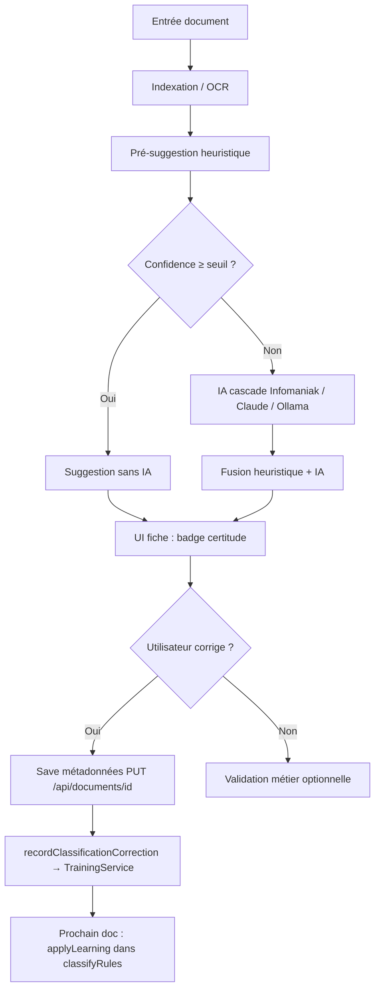

# Workflow documentaire — K-Docs (GEDv1)

> **Lot 0** — référence produit pour l'identification documentaire ECM (hors WinBiz).
> Complète `tests/visual/FUNCTIONS-SPEC.md` (UI) et `docs/PARITE-REDX-TESTS.md` (gaps REDX).
>
> Dernière mise à jour : 2026-07-01 (post-lots 1–3 finalisation REDX).

---

## 1. Périmètre et prérequis

### In scope (socle ECM)

Cycle complet d'un document entrant jusqu'à son **identification métier** :

| Type documentaire | Code BDD | Rôle |
|-------------------|----------|------|
| Facture | `FACTURE` | Comptabilité, validation plafonnée |
| Note de crédit | `NOTE_CREDIT` | Avoirs, corrections comptables |
| Contrat | `CONTRAT` | Engagements, échéances |
| Courrier | `COURRIER` | Correspondance sortante/entrante |
| Reçu | `RECU` | Justificatifs, paiements |

Oracle catalogue : gate **`G6-doc-types-ecm`** (`tools/eval-full.php`).

### Hors scope (plugins — après socle opérationnel)

| Module | Statut | Doc |
|--------|--------|-----|
| **WinBiz / rapprochement ERP** | Plugin, non prioritaire | `docs/WINBIZ-MODULE.md`, `docs/WINBIZ-PLUGIN-REPOSITIONNE.md` |
| CmdV4 ingest | Connecteur séparé | `docs/CMD-V4-CONNECTOR.md` |
| SMQ / versions | Plugin gated | `PluginRegistry::isEnabled('smq')` |

**Règle produit** : tant que les 5 types ECM ne sont pas identifiables de façon fiable (auto + correction + persistance), **aucun push** sur le module WinBiz.

---

## 2. Vue d'ensemble (pipeline)



**Invariant** : `classification.auto_apply=false` par défaut — l'IA **suggère**, l'humain **valide**.

---

## 3. Étapes détaillées

### 3.1 Entrée document

| Canal | Route / service | Effet |
|-------|-----------------|-------|
| Upload UI | `POST /api/documents/upload` | Fichier + `relative_path` + job OCR |
| Consume | `POST /api/consume` | Scan dossier watch |
| Index dossier | `POST /api/folders/index` | Réconciliation disque ↔ BDD |
| eval-full (test) | `tools/eval-full.php` | Lot `eval/lot-original` (8 PDF réels) |

**Oracle rangement** : F-LIB-03 — document visible dans le dossier cible (`relative_path` non null).

### 3.2 OCR & contenu indexé

| Composant | Fichier | Oracle |
|-----------|---------|--------|
| OCR | `OCRService`, `DocumentProcessor` | `documents.content` ≈ `ocr_text` après traitement |
| Retraitement | `POST /api/documents/{id}/ocr` | F-DOC-03 — contenu rafraîchi |

Gate P0 : **GAP-003** (`DocumentProcessorTest`).

### 3.3 Pré-suggestion heuristique (sans IA)

| Composant | Fichier | Rôle |
|-----------|---------|------|
| Règles regex + mots-clés | `AutoClassifierService::classifyRules()` | Type, correspondant, tags, date, montant |
| Apprentissage patterns | `AutoClassifierService::applyLearning()` | Consulte `TrainingService` (corrections passées) |
| Seuil skip IA | `CLASSIFY_HEURISTIC_THRESHOLD` (env, défaut **0.6**) | Si type trouvé + confidence ≥ seuil → **IA non appelée** |

**Principe** : OCR rapide → heuristique rapide → IA lente seulement si nécessaire.

### 3.4 Classification IA (si heuristique insuffisante)

| Composant | Fichier | Rôle |
|-----------|---------|------|
| Orchestration | `DocumentsApiController::classifyWithAI` | OCR si manquant → heuristique → IA ou skip |
| Cascade | `AIProviderService` | Infomaniak > Claude > Ollama |
| Persistance | migration 023 | `classification_suggestions`, `classification_confidence`, `needs_review` |
| UI | `#ai-suggest-btn`, `#ai-confidence-badge` | F-DOC-02 — badge vert ≥80 %, neutre ≥60 %, rouge <60 % |

Seuil review : `CLASSIFY_REVIEW_THRESHOLD` (env, défaut 0.6) → `needs_review=1`.

### 3.5 Identification & édition métadonnées (humain)

| Champ | UI | API | Oracle |
|-------|-----|-----|--------|
| Type | `#preview-type-select` | `PUT /api/documents/{id}` (`document_type_id`) | F-DOC-01 |
| Correspondant | `#preview-correspondent-select` | idem | F-DOC-01 |
| Date / montant | `#preview-date-input`, `#preview-amount-input` | idem | F-DOC-01 |
| Save | bouton « Enregistrer les modifications » | PUT JSON (BodyParsingMiddleware requis) | persistance API |

**Fix 2026-07-01** : `App::addBodyParsingMiddleware()` — sans middleware, le PUT JSON ignorait le body.

Specs Playwright :
- `workflow-doc-identification.spec.ts` — sélection Contrat + save + oracle GET
- `persona-redx-expert.spec.ts` — champs métadonnées + types ECM dans le select
- `bugs-misc.spec.ts` — persistance via formulaire `/documents/{id}/edit`

### 3.6 Correction utilisateur → apprentissage

| Événement | Hook | Effet |
|-----------|------|-------|
| Save fiche (type/correspondant changé) | `DocumentsApiController::recordClassificationCorrection` | `TrainingService::storeCorrection` |
| PUT `/type`, `/correspondent` | idem | idem |
| Prochaine classification | `AutoClassifierService::applyLearning` | Pré-suggestion affinée |

Guard : `CLASSIFY_LEARNING_ENABLED` (défaut `true` ; `false` en phpunit).

### 3.7 Validation métier (optionnelle, rôle-dépendante)

| Rôle persona | Plafond | Scope | Spec |
|--------------|---------|-------|------|
| `eval_secretaire` | 1 000 CHF | * | `persona.spec.ts` |
| `eval_comptable` | 5 000 CHF | FACTURE | idem |
| `eval_rh` | — | RH | idem |
| `eval_employeur` | illimité | * | idem |
| `eval_redx_expert` | illimité (APPROVER) | * + VALIDATOR_L2 FACTURE | `persona-redx-expert.spec.ts` |

Oracle : `GET /api/validation/{id}/can-validate` → `{ can_validate, reason }`.

---

## 4. Persona expert REDX (`eval_redx_expert`)

Créé par `eval-full.php` — parcours **ECM documentaire**, pas ERP.

| Étape | Action | Gate |
|-------|--------|------|
| 1 | Login → bibliothèque `eval/lot-original` | `persona-redx-expert.spec.ts` |
| 2 | Types ECM visibles (API + select UI) | `G6-doc-types-ecm`, `F-REDX-TYPES` |
| 3 | Fiche : métadonnées + badge certitude | pas de lien `/invoices` |
| 4 | Identification manuelle type Contrat + save | `workflow-doc-identification.spec.ts` |
| 5 | Droits validation facture 6000 CHF | `G6-persona-redx-expert` |

---

## 5. Gates & harness

### CLI — eval-full

```cmd
cd GEDv1
php tools/eval-full.php --no-ocr
```

Gates workflow documentaire :

| Gate | Oracle |
|------|--------|
| `G6-doc-types-ecm` | 5 types présents en BDD |
| `G6-persona-redx-expert` | Peut valider facture + RH |
| Distribution types (lot eval) | JSON classification post-ingest |

### Harness complet

```cmd
run-harness.bat
```

Enchaîne : migration smoke → PHPUnit 340 → eval-full → Playwright (43 specs, hors WinBiz / live-IA lourds).

### Tests oracle (lots 1–2)

| Test | Épingle |
|------|---------|
| `DocumentTypeIdentificationTest` | Patterns regex types ECM (hermétique) |
| `ThumbnailGeneratorTest` | `pdftoppm` exécutable (GAP-002) |
| `TagsDedupTest` | find-or-create insensible casse (T-TAG-DEDUP) |

---

## 6. Lot B — identification auto (GAP-055) ✅

Gate **`G7-classify-distribution`** (`eval-full.php`) : sur le lot `eval/lot-original` (--no-ocr),
heuristique `AutoClassifierService::classifyRules()` + persistance `document_type_id`.

Oracle minimal : Reçu ≥ 2 · Courrier ≥ 1 · Contrat ≥ 1 · ≥ 5/8 docs typés ECM · ≤ 3 sans type.

Tests : `DocumentTypeIdentificationTest` (texte + noms fichiers PICKS) · harness vert.

**Suite** : sous-séquence C (CmdV4 stash) · WinBiz plugin après validation humaine.

---

## 7. Références croisées

| Document | Contenu |
|----------|---------|
| `tests/visual/FUNCTIONS-SPEC.md` | Fonctions UI + mapping personas |
| `docs/PARITE-REDX-TESTS.md` | Gaps REDX + tests par gap |
| `docs/DELTA-REDX.md` | Score parité ~54 % |
| `docs/AUDIT-IA-CLASSIFICATEUR.md` | Audit stack IA (2026-06-18) |
| `SESSION-STATUS.md` | État courant + commits |
